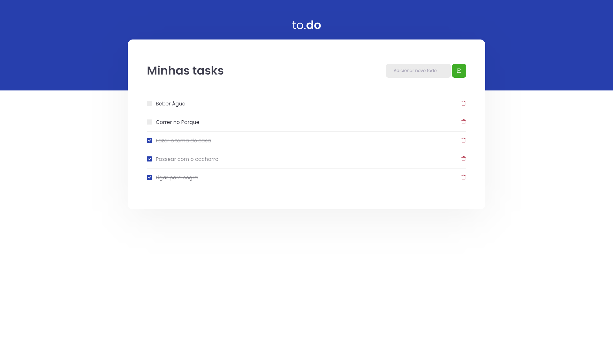

# React Concepts Exercise To-do List
> A functional to-do list made in React


For this project, my task was to create from a template one to-do app work. I have used the concepts learned in Ignite course from Rocketseat



## Requirements
- NodeJS
- Git


## Development setup

1. Clone this repo in your terminal

``` git clone https://github.com/PedroArch/todo-exercise.git ```

2. Still in terminal
```npm install```

or if you prefer yarn commands
```yarn ```


## Running the program

1. Just run in your terminal 
```syarn dev ```


## Usage example

In the root page `http://localhost:8080/` you can see the application working.

_If you find bugs or problems you can sent a message to me [twitter] or [email]._


## Release History

* 1.0
   * first version

## Meta

Pedro Carvalho – [@PedrArch](https://twitter.com/PedroArch) – pedrofrancocarvalho@gmail.com

[https://github.com/PedroArch](https://github.com/PedroArch/)

## Contributing

1. Fork it (<https://github.com/PedroArch/todo-exercise>)
2. Create your feature branch (`git checkout -b feature/fooBar`)
3. Commit your changes (`git commit -am 'Add some fooBar'`)
4. Push to the branch (`git push origin feature/fooBar`)
5. Create a new Pull Request

<!-- Markdown link & img dfn's -->
[twitter]:https://twitter.com/PedroArch
[github]:https://github.com/PedroArch
[email]: pedrofrancocarvalho@gmail.com
